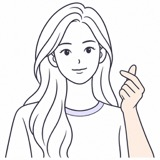
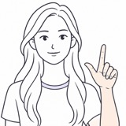

# Gift Lab · AR 互动礼物

主播通过自己的动作触发虚拟礼物，让特效与人物产生进一步互动，表达爱意、为自己打 call，或营造惊喜与感动的氛围

**[打开在线 Demo](https://zii-i-del.github.io/ar-gift-demo/)** · [代码仓库](https://github.com/zii-i-del/ar-gift-demo)

选择横屏或竖屏，点击「开启摄像头」并允许权限，等待识别准备完成后即可体验。当前按单人互动设计，视频在浏览器本地处理，不录制或上传

| 感动彩带 | 指尖爱心 | 为自己打call |
| :---: | :---: | :---: |
|  |  |  |

以上为手势示意图，实际动态效果请在 Demo 中体验

## 三种互动玩法

| 名称 | 表达意图 | 触发动作 | 视觉与互动效果 |
| --- | --- | --- | --- |
| 感动彩带 | 惊讶、感动 | 双手捂嘴，保持片刻 | 星星彩带飘落，依据有效识别结果停留在头发和肩膀上 |
| 指尖爱心 | 向粉丝表达爱意 | 拇指与食指交叉比心 | 保持手势，指尖持续生成爱心；横屏下可与脸部碰撞 |
| 为自己打call | 为自己加油，活跃气氛 | 拇指、食指伸直，其余三指收拢，形成类似数字 8 的泡泡发射器手势 | 指尖持续发射泡泡；张开任意一只手的手掌可拨动泡泡 |

左右手都可用于发射爱心或泡泡。同一时刻由一只主要发射手负责，停止或离开后可交给另一只手，避免双手平分发射机会后每侧视觉速率变慢。明确改变手势后停止新增，已生成的特效继续运动直至消失

彩带触发后，任意一只手离嘴片刻即可重新准备；下一轮仍需等待当前播放结束，再确认双手捂嘴。头发和肩膀能否承接取决于当时的有效识别结果，不保证每次都有落点

### 横屏与竖屏

| 特效 | 横屏 16:9 | 竖屏 9:16 |
| --- | --- | --- |
| 指尖爱心 | 持续生成，并与脸部碰撞 | 持续生成，不启用脸部碰撞 |
| 为自己打call | 泡泡可与手掌、脸部和画面边缘碰撞 | 泡泡轻摆上浮，可被手掌拨动；不启用脸部和边缘反弹，离开画面后回收 |
| 感动彩带 | 按横屏画面配置数量与尺寸 | 按竖屏画面调整数量与尺寸；同样依赖有效的头发、肩部承接表面 |

## 设计取舍与性能

最初的创意是“微笑下雨、大笑烟花”。微笑与大笑在直播中较常出现，直接作为触发条件容易打断正常表达；“微笑下雨”的情绪对应也不够直观。因此原型改为由主播主动表达爱意、加油和感动，并增加特效与人物的接触互动。**当前交付的是需求探索后的手势版本，未实现微笑下雨、大笑烟花**

当前代码采用以下方式控制开销：

| 措施 | 实现方式 |
| --- | --- |
| 识别与渲染分开 | 单个 Web Worker 处理脸、手、头发和肩部识别，主线程负责页面与特效展示 |
| 不堆积视频帧 | 使用 `createImageBitmap` 取帧，最多一帧识别在途，过期结果不参与当前互动 |
| 按需调度 | 根据任务耗时、预算和互动阶段安排识别；头发与肩部不在空闲时持续高频推理 |
| 分开处理初始化成本 | 头发、肩部通过真实帧预热与后续测量建立耗时估计，实际推理耗时仍计入预算；持续受阻时允许受控重新测量 |
| 控制渲染成本 | 三种特效共用一个 Three.js 渲染器，使用固定容量对象池，渲染像素比上限为 1.5 |
| 控制碰撞计算 | 针对人物轮廓、手掌和承接表面计算轻量碰撞响应，不为每个粒子配置通用刚体，也不做泡泡之间的两两碰撞 |

这些是代码中的成本控制措施，不代表所有设备都能达到固定帧率或识别准确率。调度目标与实际帧率不同，体验仍需结合设备、浏览器和画面条件验证

## 本地运行

需要 Git、Node.js **≥22.13.0** 和 pnpm。仓库提交了 `pnpm-lock.yaml`，安装时使用锁文件

```bash
git clone https://github.com/zii-i-del/ar-gift-demo.git
cd ar-gift-demo
pnpm install --frozen-lockfile
pnpm run dev
```

打开终端显示的 localhost 地址。摄像头需要 HTTPS 或 localhost 安全上下文以及用户授权，直接打开 HTML 文件不能代替本地服务器

`dev` 使用 Vinext 开发入口，启动前会自动执行 [模型准备脚本](scripts/prepare-vision.mjs)：从已安装的 MediaPipe 包复制运行文件，并下载固定版本的脸、手、头发和肩部模型。首次准备需要网络；已有模型会复用。运行时浏览器从网站同源加载这些资源，视频帧不发送到模型下载服务器

### 构建与预览 GitHub Pages 版本

```bash
pnpm run build:pages
pnpm exec vite preview --config pages/vite.config.ts --host 127.0.0.1
```

构建输出为 `pages-dist/`，预览地址以终端输出为准。该静态入口复用主页、样式和特效逻辑，不包含本地测试页面

`build:pages` 会清空输出目录，不能把需要保留的文件或 Git 工作目录放在 `pages-dist/` 内

## 代码导览

```text
摄像头 → Worker 识别与调度 → 手势确认和碰撞计算 → Three.js 展示
```

| 位置 | 职责 |
| --- | --- |
| [app/page.tsx](app/page.tsx) | 摄像头权限、方向切换、识别会话、状态提示和特效协调 |
| [public/tracking-worker.js](public/tracking-worker.js)、[public/gift-scheduler.js](public/gift-scheduler.js) | MediaPipe 模型初始化、推理、预热和任务调度 |
| [lib/](lib/) | 手势判断、主要发射手选择、彩带状态、坐标转换和碰撞响应 |
| [lib/gift-renderer.ts](lib/gift-renderer.ts) | 共享渲染器及三种特效的展示与资源释放 |
| [public/assets/](public/assets/) | 爱心、泡泡模型与材质，以及手势说明插图 |
| [pages/](pages/) | GitHub Pages 的静态入口和 Vite 构建配置 |

主要技术：React、TypeScript、MediaPipe Tasks Vision、Three.js；本地开发使用 Vinext，GitHub Pages 使用 Vite 静态构建，不需要业务后端或 API Key

### 发布方式

- `main` 保存源码，GitHub Pages 从 `gh-pages` 分支根目录提供网站
- 更新后先构建，再将 `pages-dist/` **目录内的产物**发布到 `gh-pages`；只推送 `main` 不会更新在线页面
- `public/vision/` 是生成资源，不提交到源码分支，但构建时必须随模型、WASM 和其他静态资源一起发布
- 发布后核对入口、脚本、图片和模型是否可访问，再实际验证摄像头与三种互动

## 使用限制与问题排查

请尽量单人入镜，让脸和整个手部保持在画面内，并使用充足光照。多人、遮挡、手部出框和不可靠关键点可能导致误判或不触发；当前不承诺多人归属判断。首次加载与预热需要时间，移动端和 PC 的实际耗时可能不同

识别不顺利时，点击「显示识别信息」查看手部关键点、结果新鲜度与泡泡失败原因；需要恢复识别时使用「重试识别」，也可以关闭后重新开启摄像头，必要时刷新页面

| 现象 | 检查与处理 |
| --- | --- |
| 摄像头未能开启 | 检查站点摄像头权限、HTTPS/localhost、设备可用性及其他应用占用情况 |
| 素材或模型长时间准备中 | 检查网络和静态资源请求；素材、模型、WASM 加载失败与手势判断失败是不同问题 |
| 能看到手部关键点，但未触发 | 对照示意图，完整露出手部并保持片刻；关键点存在不等于动作已满足确认条件 |
| 一直提示准备头发接触表面 | 检查头发结果是否新鲜、是否有有效发区；确认头部入镜和光照。持续失败可重试识别，不能仅凭该提示认定模型未检测到头发 |
| 肩部未承接彩带 | 肩部可能出框、被遮挡或没有有效承接区域；肩部不可用时彩带可仅停留在头发上 |
| 提示识别中断 | 使用「重试识别」重建会话；仍失败时重新开启摄像头或刷新，并检查浏览器控制台 |

网页需要浏览器支持摄像头相关 API 与 WebGL。公开链接的可用性受 GitHub Pages 网络覆盖、浏览器权限和设备条件限制

## 验证

安装依赖后，可在仓库根目录执行：

```bash
pnpm exec tsc --noEmit
pnpm run build:pages
```

类型检查和构建通过不等于真人识别验收通过，还需手动检查：

- 横屏、竖屏切换后，画面、手势插图和状态提示正常
- 三种动作分别触发；爱心和泡泡持续保持时正常发射，明确改变手势后停止新增
- 左右手均可发射，双手同时出现时主要发射手不会因分摊而降速
- 横屏脸部碰撞、泡泡边缘反弹，以及横竖屏手掌拨动泡泡符合说明
- 彩带播放后离嘴、重新捂嘴可开始下一轮；未就绪或无有效承接表面时提示合理
- 重试识别、关闭并重新开启摄像头、页面切后台再返回后可恢复体验

如记录性能或成功率，请同时记录设备、浏览器、横竖屏模式和测试条件。本文不以历史本地测试数量代替公开仓库的可复现验收结果
